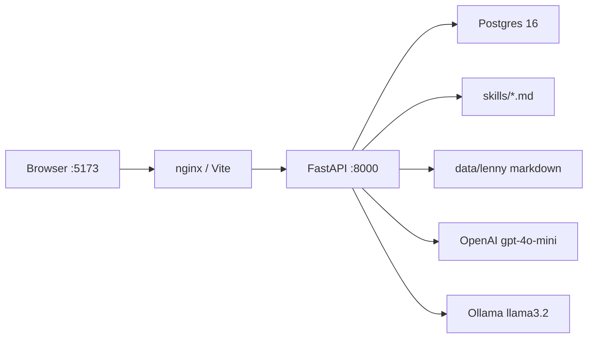

# Architecture — Lenny Growth Assistant

How the running system is put together. Product intent lives in `PRD.md`.

## Shape



Three processes: **web** (static React, nginx in Docker), **api** (FastAPI), **postgres**. The API owns retrieval, skills, and LLM calls. The browser never talks to the model.

Local alternative: Postgres from Compose, `uvicorn` on 8000, `npm run dev` on 5173 with a Vite proxy.

## Runtime

| Piece | Role |
|---|---|
| `frontend/` | Chat list, thread, provider toggle, artifact viewer |
| `backend/app/` | HTTP, ingest, search, writing, sanitizing |
| `skills/ship30/SKILL.md` | Essay craft, loaded into the prompt |
| `skills/artifacts/SKILL.md` | HTML one-pager craft |
| `data/lenny/` | Public starter pack (gitignored; clone from README) |
| `data/sample/` | Tiny fixture if Lenny data is missing |
| `pgvector/pgvector:pg16` | Postgres. Vectors are unused; keyword ranking ships |

Compose maps host **5433 → 5432** so a local Postgres on 5432 does not collide. Inside the network the API uses `postgres:5432`. `OPENAI_API_KEY` comes from `backend/.env` via `env_file`. `OLLAMA_BASE_URL` in Docker is `http://host.docker.internal:11434`.

On empty database, `init_db` creates the demo user and runs ingest.

## Data model

```
users 1──* sessions 1──* messages
                 └──* artifacts
sources 1──* chunks
```

- **users** — one synthetic row (`00000000-0000-0000-0000-000000000001`, “Growth Team”). No auth.
- **sessions** — title from the first user line (48 chars). `updated_at` on each message.
- **messages** — `user` / `assistant`, `citations` as JSONB.
- **artifacts** — `kind` `markdown` or `html`, tied to the assistant message that produced them.
- **sources** — path unique, SHA-256 checksum, optional guest and `published_at` from `index.json`.
- **chunks** — ~400 words, 40-word overlap, heading from the nearest markdown `#`.

There is no embeddings column.

## HTTP

| Method | Path | Notes |
|---|---|---|
| GET | `/health` | Process up; no DB |
| GET | `/ready` | 503 if Postgres is down |
| GET/POST | `/config` | `provider` `openai` \| `ollama`; POST writes `backend/.runtime.json` |
| GET/POST | `/sessions` | List / create for the demo user |
| GET | `/sessions/{id}` | Messages + artifacts |
| POST | `/sessions/{id}/messages` | One user turn → assistant + optional artifacts |
| POST | `/admin/ingest` | Idempotent re-index of `DATA_DIR` |
| GET | `/admin/sources` | Catalog |
| GET | `/admin/search?q=` | Same ranking as chat, for debugging |

nginx (and Vite in dev) proxy `/sessions`, `/health`, `/ready`, `/admin`, `/config` to the API. Essay generation can take up to 120s; nginx `proxy_read_timeout` is 180s.

## Ingest

1. Read `DATA_DIR` (Lenny pack if `index.json` exists, else `data/sample`).
2. Walk `.md` files; skip license/readme.
3. Join metadata from `index.json` (list or `{podcasts, newsletters}`).
4. If checksum unchanged, skip. Else replace chunks.

`source_type` is `newsletter` or `podcast` from the path.

## Retrieval

Not embeddings. Flow:

1. Tokens longer than 3 characters from the query.
2. SQL `ILIKE` over chunk body, cap 80 rows.
3. Score: +4 title, +3 guest, +1 body.
4. Drop rows more than 1 point below the best score (so “grow” alone does not flood the list).
5. One chunk per source, top 4 (chat) or 6 (essay/HTML).
6. Essays/HTML then load up to 10 chunks from the **best** source so the writer sees one transcript in depth.

Empty hits → refusal text, no fake citations. Follow-ups prepend the last user question to the search string.

## A chat turn

`POST /sessions/{id}/messages`:

1. Load the session’s prior messages (history, last user line).
2. Route with `wants_essay` / `wants_html` (`backend/app/essay.py`). Essay wins if both match.
3. Search as above.
4. Write:
   - chat → `write_grounded_answer`
   - essay → skill file + excerpts + history
   - HTML → skill file + excerpts, then `sanitize_html` and strip code fences
5. If the model returns nothing, use snippet fallback (or an explicit “couldn’t reach the model” line).
6. Persist user + assistant. If an artifact was made, store it; chat text is a short “opened beside the chat” line, not the full document.
7. JSON log: retrieve hit count; LLM ok/fail. No prompts or keys.

Providers (`backend/app/llm.py`): OpenAI `/chat/completions` or Ollama `/api/chat`. Missing OpenAI key or a thrown error → `None` → fallback. Timeout 120s.

## Frontend

React 18 + Vite. No extra UI libraries.

- Sidebar: provider, new chat, session list (own scroll).
- Main: welcome starters or thread + composer (own scroll). Enter sends.
- Viewer: only if the session has artifacts (own scroll). Markdown is escaped then lightly formatted. HTML is `iframe sandbox=""`.

## Security (demo)

- No auth. Do not expose the admin routes on a public network.
- HTML: strip `script` / `iframe` / handlers / `javascript:`. Iframe cannot run scripts.
- Markdown in the viewer is HTML-escaped first.
- Secrets stay in `backend/.env` (gitignored). Compose does not bake the key into the image.

## Tests

From `backend/`: `python -m pytest`. Coverage is ranking, chunking, essay vs HTML routing, sanitizer, both `index.json` shapes, `/health`. Not a live LLM.

## What we would change next

1. pgvector + embeddings when keyword misses on paraphrase.
2. Stream tokens once latency on essays bothers the team.
3. Swap the HTTP loop for Claude Agent SDK without rewriting `SKILL.md` files.
