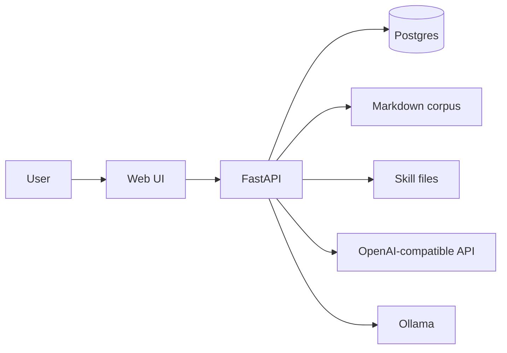

# Architecture — Lenny Growth Assistant

This is how the system is built and how to change it. Product intent is in `PRD.md`. Run instructions are in `README.md`.

## 1. Goals of the design

- The browser never calls a model. One API owns retrieval, skills, writing, and persistence.
- Grounding is a data-path property: the writer only sees retrieved chunks, not the open web.
- Writing craft is versioned as files in `skills/`, so a PM and an engineer can read the same rules.
- Operators can run a cloud writer, a local OpenAI-compatible writer, or neither (snippets only) without forking the app.
- The corpus is a directory of markdown plus an index, not a hard-coded list of titles.

## 2. Context



The UI is a static React app. In production-style Compose it is served by nginx, which also reverse-proxies API routes. In development, Vite serves the UI and proxies the same paths.

Postgres holds users, sessions, messages, artifacts, sources, and chunks. The corpus on disk is the source of truth for ingest; the database is the serving index.

## 3. Components

| Path | Responsibility |
|---|---|
| `frontend/` | Session list, thread, provider toggle, artifact viewer |
| `backend/app/main.py` | App lifespan, health, ready, config |
| `backend/app/sessions.py` | Chat API, turn orchestration |
| `backend/app/retrieval.py` | Search, ranking, citations, extra chunks for long form |
| `backend/app/ingest.py` | Walk markdown, checksum, replace chunks |
| `backend/app/chunking.py` | Heading-aware word windows |
| `backend/app/essay.py` | Essay vs HTML routing and topic extraction |
| `backend/app/llm.py` | Provider HTTP, grounded prompts, skill injection |
| `backend/app/artifacts.py` | Titles, HTML sanitize, artifact rows |
| `backend/app/admin.py` | Ingest, source catalog, debug search |
| `backend/app/config.py` | Settings from env; last provider in `.runtime.json` |
| `backend/app/log.py` | JSON logs, allow-listed fields |
| `skills/ship30/SKILL.md` | Essay craft |
| `skills/artifacts/SKILL.md` | One-pager craft |
| `data/lenny/` | Configured corpus (not committed) |
| `data/sample/` | Minimal fixture when the full pack is absent |

The image `pgvector/pgvector:pg16` is Postgres 16 with vector support available. Serving search is keyword ranking. An embeddings column can be added without changing the chat contract.

## 4. Processes and ports

Compose runs three services:

- **postgres** — database. Published on the host as `5433` so the container’s `5432` does not fight a typical local Postgres. Inside the Compose network the API uses `postgres:5432`.
- **api** — Uvicorn, `8000`. `DATABASE_URL` points at the Compose database. `DATA_DIR` and `SKILLS_DIR` are mounted. `OPENAI_API_KEY` is read from `backend/.env` (`env_file`). `OLLAMA_BASE_URL` is `http://host.docker.internal:11434` so a writer on the host is reachable.
- **web** — nginx on `80`, published as `5173` to match the Vite dev port. Proxies `/sessions`, `/health`, `/ready`, `/admin`, `/config` to `api:8000`. Read timeout is 180s so a long essay is not cut off.

Split development: Compose for Postgres only; Uvicorn from `backend/` with `backend/.env`; Vite from `frontend/` with the proxy in `vite.config.ts`.

On startup, `init_db` creates tables, ensures the single workspace user exists, and ingests if there are no sources yet.

## 5. Data model

```
users 1──* sessions 1──* messages
                 └──* artifacts
sources 1──* chunks
```

**users.** One workspace row. Fixed id `00000000-0000-0000-0000-000000000001`, display name from settings. All sessions are owned by this user. There is no password table.

**sessions.** `title` (default “New chat”, then first user line truncated to 48 characters), `created_at`, `updated_at`.

**messages.** `role` (`user` | `assistant`), `content`, `citations` (JSONB array of title, guest, path, type, heading), `created_at`.

**artifacts.** `kind` (`markdown` | `html`), `title`, `content`, optional `message_id`. The thread stores a short “opened beside the chat” line; the body lives here so the viewer can reload it.

**sources.** `source_type` (`podcast` | `newsletter`), `title`, `guest`, `published_at`, unique `path`, SHA-256 `checksum`, full `content`.

**chunks.** `ordinal`, `heading`, `content`, `token_count` (word count today). Windows are about 400 words with 40 words of overlap, split on markdown headings first.

No embedding column. Citations are denormalized onto the message so the UI does not join at read time.

## 6. Configuration

Pydantic settings (`backend/app/config.py`), env file `backend/.env`:

| Variable | Role |
|---|---|
| `DATABASE_URL` | Async SQLAlchemy URL (`postgresql+asyncpg://…`) |
| `DATA_DIR` | Corpus root |
| `SKILLS_DIR` | Skill markdown root |
| `LLM_PROVIDER` | `openai` or `ollama` (UI can override) |
| `OPENAI_API_KEY`, `OPENAI_MODEL`, `OPENAI_BASE_URL` | Cloud writer |
| `CHAT_MODEL`, `OLLAMA_BASE_URL` | Local writer |
| `LLM_TIMEOUT_SECONDS` | Default 120 |

`POST /config` updates the in-process provider and writes `backend/.runtime.json` so a reload of the API process keeps the last UI choice. The file is gitignored. Compose does not mount it; a new API container starts from env again.

Do not commit secrets. The image does not COPY `.env`.

## 7. HTTP surface

| Method | Path | Behavior |
|---|---|---|
| GET | `/health` | Process is up. No database. |
| GET | `/ready` | 200 if Postgres answers; 503 with an error body if not. |
| GET | `/config` | Current provider, model name, whether an OpenAI key is present. |
| POST | `/config` | `{ "provider": "openai" \| "ollama" }`. |
| GET | `/sessions` | Sessions for the workspace user, newest first. |
| POST | `/sessions` | Create. Optional title. |
| GET | `/sessions/{id}` | Messages and artifacts. 404 if not the workspace user. |
| POST | `/sessions/{id}/messages` | One turn. Body `{ "content": "…" }`. Returns user, assistant, new artifacts, session title. |
| POST | `/admin/ingest` | Walk `DATA_DIR`, upsert sources, replace chunks when checksum changes. |
| GET | `/admin/sources` | Catalog. |
| GET | `/admin/search?q=` | Same ranking as chat, for inspection. |

There is no public auth layer. Treat `/admin` as an internal operator API.

## 8. Ingest

1. Resolve the data root (`DATA_DIR`, or sample if the Lenny index is missing).
2. Load `index.json` if present. Accept either a flat list or `{ "podcasts": [...], "newsletters": [...] }`. Paths may be `path` or `filename`.
3. Walk `*.md`. Skip license and readme names.
4. Derive `source_type` from path segments (`newsletter(s)` vs default podcast).
5. Title from the first `# ` heading, else the stem. Guest and `published_at` from the index when present.
6. Checksum the file body. Unchanged checksum → skip. Changed → replace all chunks for that source.

Re-ingest after the dump on disk changes. It is safe to run more than once.

## 9. Retrieval

Serving search is lexical, not vector.

1. Take alphanumeric tokens longer than three characters from the query (lowercased).
2. `ILIKE` those terms against chunk body, cap 80 SQL rows.
3. Score each row: +4 if the term is in the source title, +3 in guest, +1 in body.
4. Keep rows within one point of the best score so a generic verb does not drag in the whole corpus.
5. Deduplicate by source path. Return the top four chunks for chat, six for essay or HTML.
6. For essay and HTML, load up to ten chunks from the single best source so the writer sees depth in one transcript rather than thin slices of many.

Follow-ups concatenate the previous user question with the current text before search, so “what about the paywall” still hits the company from the turn before.

Zero hits: the API still responds. The writer is either skipped or told there is no support. Citations are empty. Nothing is invented to fill the list.

## 10. A chat turn

`POST /sessions/{id}/messages` is the only orchestration:

1. Load the session and its messages. Build `history` and the last user string.
2. Classify with `wants_essay` / `wants_html`. Markers live in `essay.py`. If both could match, essay wins.
3. Build `search_text`: strip format markers for special turns (`topic_query`), then prepend last user question when it exists.
4. Retrieve as in §9.
5. Write:
   - chat → `write_grounded_answer` (excerpts + history, last eight turns)
   - essay → skill file + excerpts + shorter history
   - HTML → skill file + excerpts, then strip fences and `sanitize_html`
6. If `complete()` returns `None` (no key, timeout, HTTP error, unknown provider), use snippet fallback, or a short “could not reach the model” line when a long-form document was requested.
7. Persist user and assistant. If long form succeeded, insert an artifact and set the assistant text to a confirmation that names the title.
8. Rename the session if it was still “New chat”.
9. Log retrieve (`hits`, `kind`, `session_id`) and writer outcome (`provider`, `model`, error string). Not the prompt, not the key.

## 11. Writers

`backend/app/llm.py` exposes `complete(prompt)` then three product functions on top.

- **OpenAI path:** `POST {OPENAI_BASE_URL}/chat/completions` with `Authorization: Bearer`. Default model `gpt-4o-mini`.
- **Ollama path:** `POST {OLLAMA_BASE_URL}/api/chat` with `stream: false`. Default model `llama3.2`.

Both are ordinary HTTP. Temperature is low. Timeout is `LLM_TIMEOUT_SECONDS`.

Grounding instructions are in the user prompt: answer only from the excerpts; if they are insufficient, say so. Skills are prepended as system-style text for essay and HTML.

This adapter is the seam for a future Anthropic loop. Do not scatter provider URLs through `sessions.py`.

## 12. Frontend

React 18 and Vite. JSX via esbuild; no extra UI kit.

Layout is a locked viewport (`height: 100%` on `html`, `body`, `#root`):

- **Sidebar** — brand, provider segmented control, new chat, session list. Only the list scrolls.
- **Main** — welcome (starter prompts) or thread header + messages + composer. Only the thread scrolls. Enter sends; Shift+Enter is a newline.
- **Viewer** — mounted when the session has artifacts. Header stays; document body scrolls. Markdown is escaped, then a small subset of headings and lists is restored. HTML is `iframe` with `sandbox=""` (no scripts, no same-origin).

nginx (Compose) and Vite (dev) must proxy the same API prefixes. If a new public route is added on FastAPI, add it to `frontend/nginx.conf` and `frontend/vite.config.ts`.

## 13. HTML safety

Generated HTML is untrusted.

Server: drop `script` and `iframe` blocks, `object`/`embed`/`link`/`meta`, inline `on*` handlers, `javascript:` URLs. Strip leading/trailing markdown fences so models that wrap markup do not leak into the iframe.

Client: `sandbox=""` and `srcDoc`. Markdown in the viewer is escaped before any formatting.

This is defense in depth for an internal tool, not a substitute for keeping `/admin` off the public internet.

## 14. Observability and tests

Logs are one JSON object per line: timestamp, level, message, plus allow-listed extras (`event`, `provider`, `model`, `hits`, `kind`, `error`, `session_id`).

Tests live under `backend/tests/`. Run `python -m pytest` from `backend/`. They cover health, chunk windows, ranking (including title weight and “grow” noise), essay vs HTML routing, sanitizer, and both index shapes. They do not call a live model.

## 15. Failure modes

| Condition | Behavior |
|---|---|
| Postgres down | `/health` 200, `/ready` 503, chat fails |
| Empty corpus | Ingest on boot if possible; otherwise search returns no hits and the assistant refuses |
| No OpenAI key, OpenAI selected | Writer skipped; snippets or an explicit failure line |
| Ollama down, Ollama selected | Same |
| Writer timeout or 4xx/5xx | Same; error string in logs |
| User message empty | 400 |
| Unknown session | 404 |

## 16. Extension points

- **New corpus** — point `DATA_DIR` at a tree with markdown and a compatible `index.json`; ingest.
- **New writing format** — add `skills/<name>/SKILL.md`, a router predicate, a writer that loads the file, and an artifact `kind` if it should open in the viewer.
- **New model** — env for base URL and model name. Keep OpenAI-compatible JSON if possible.
- **Embeddings** — add a column and a retriever behind `search_chunks`; leave the session JSON unchanged.
- **Auth** — replace the constant workspace user with a real identity; keep session ownership checks in `_get_owned_session`.

Do not add a second orchestration framework to ship a new document type. The expensive part of this system is trust in the archive, not the HTTP loop.
